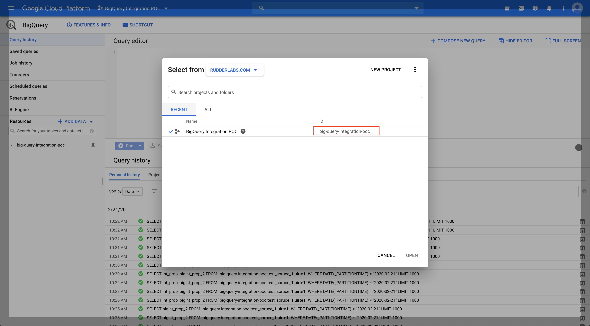

# Google BigQuery

\*\*\*\*[Google BigQuery](https://cloud.google.com/bigquery) ****is an industry-leading, fully-managed cloud data warehouse that allows you to store and analyze petabytes of data in no time.

RudderStack allows you to dump your customer event data into Google BigQuery by adding it as a destination to the source of your choice.


Please check our [Warehouse Schemas](https://docs.rudderstack.com/data-warehouse-integration-guides/warehouse-schemas) guide to know how events are mapped to the tables in BigQuery.


## **Setting up Google BigQuery**

Follow these steps to set up Google BigQuery before adding it as a destination in RudderStack:

* Create a Google Cloud Platform \(**GCP**\) project if you do not have an existing one. More details can be found [here](https://cloud.google.com/resource-manager/docs/creating-managing-projects?hl=en&ref_topic=6158848&visit_id=637219216155418807-3094012232&rd=1).
* Enable the BigQuery API if you have an existing project and it is not enabled. More details can be found [here](https://cloud.google.com/bigquery/docs/quickstarts/quickstart-web-ui).
* Log into the [Google BigQuery console](https://console.cloud.google.com/). Copy the project ID as shown in the following image. You will require this project ID while configuring BigQuery as a destination in the RudderStack dashboard.


Ensure that [billing](https://cloud.google.com/billing/docs/how-to/modify-project) is enabled for the project to enable RudderStack to load data into the BigQuery Cluster.


* Create a new Google Cloud Storage \(**GCS**\) bucket, or provide an existing one to store files before loading data into your BigQuery.


To ensure loading data from cloud storage to BigQuery, please make sure to co-locate your GCS storage bucket with BigQuery. More information can be found [here](https://cloud.google.com/bigquery/docs/loading-data-cloud-storage#data-locations). 


## Setting up the Service Account for RudderStack

* Create a new service account under **IAM & Admin** **&gt;** **Service Accounts**
* Add Service Account permissions as follows:
  * Add `Storage Object Creator` and `Storage Object Viewer` roles to the account
  * Add `BigQuery Job User` and `BigQuery Data Owner` roles to the account. Note: If a dataset with the name \(configurable by the setting: namespace in destination settings\) already exists, role of `BigQuery Data Editor` would suffice instead of BigQuery Data Owner
  * Create a key for the service account with JSON as the type and store it.

* Create and download the private JSON key which will be required while configuring BigQuery as a destination in RudderStack, as shown:


Make sure that you create the service account in the same project as BigQuery 


## **Configuring Google BigQuery in RudderStack**

In order to enable sending data to Google BigQuery, you will first need to add it as a destination to the source from which you are sending event data. Once the destination is enabled, events from RudderStack will start to flow to BigQuery. 

To do so, please follow these steps:

* Choose a source to which you would like to add Google BigQuery as a destination. You can also simply create the destination and connect it to a source later.


Please follow our [Adding a Source and Destination](https://docs.rudderstack.com/how-to-guides/adding-source-and-destination-rudderstack) guide to know how to add a source in RudderStack.


* Once you have set up the source, select **Google BigQuery** from the list of destinations. Give your destination a name, and then click on **Next**. You will then see the following **Connection Credentials** screen:

* Add your project ID and bucket name, as specified in the [Setting up Google BigQuery](https://docs.rudderstack.com/destinations/google-bigquery#setting-up-google-bigquery) section
* Copy the contents of the credentials JSON file you created and stored, in the section above.

That's it! You have successfully added Google BigQuery as a destination in RudderStack. Once you start sending events from your source, RudderStack will dump them into the BigQuery bucket periodically.

## Schema, Partitioned tables and Views

The source name \(written in snake case, e.g. `source_name`\) is used by RudderStack to create a dataset in BigQuery. More details about the tables and columns created can be found [here](https://docs.rudderstack.com/data-warehouse-integration-guides/warehouse-schemas).

RudderStack creates ingestion-time partition tables based on the load date, so that users can take advantage of it to query a subset of data. More details about BigQuery partitioned tables [here](https://cloud.google.com/bigquery/docs/partitioned-tables) and how we create it on load can be found [here](https://cloud.google.com/bigquery/docs/creating-partitioned-tables#creating_an_ingestion-time_partitioned_table_when_loading_data).

In addition to tables, a [view](https://cloud.google.com/bigquery/docs/views-intro) \(`<table_name>_view`\) is created for every table for de-duplication purposes. We recommend that you use the corresponding view \(contains events from last 60 days\) to avoid duplicate events in query results. Since BigQuery [views](https://cloud.google.com/bigquery/docs/views-intro#view_pricing) are merely logical views and are not cached, you can create a native table from it to save money by avoiding running the query that defines the view each time.   


Users can modify the view query to change the time window of the view. The default value is set to **60 days**.


## FAQs

### How are reserved words handled by RudderStack? 

There are some limitations when it comes to using [reserved words](https://cloud.google.com/bigquery/docs/reference/standard-sql/lexical#reserved_keywords) in a schema, table, or column names. If such words are used in event names, traits or properties, they will be prefixed with a `_`when RudderStack creates tables or columns for them in your schema.

Besides, integers are not allowed at the start of the schema or table name. Hence, such schema, column or table names will be prefixed with a `_`.

For instance, `'25dollarpurchase`' will be changed to `'_25dollarpurchase`'.

## Contact Us

If you come across any issues while configuring Google BigQuery with RudderStack, please feel free to [contact us](mailto:%20contact@rudderstack.com) or start a conversation on our [Slack](https://resources.rudderstack.com/join-rudderstack-slack) channel. We will be happy to help you.  

