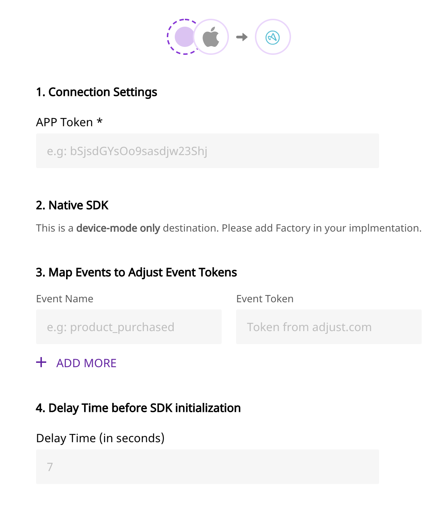

# Adjust

[Adjust](https://adjust.com) is an industry-leading mobile attribution provider that allows you to bring all your business data together to get powerful insights from it.

RudderStack allows you to configure your mobile devices with our SDKs to send your customer event data to Adjust - without any hassle. You can check the code for Adjust destination on our GitHub for [Android](https://github.com/rudderlabs/rudder-integration-adjust-android) and [iOS](https://github.com/rudderlabs/rudder-integration-adjust-ios).

## Getting Started

Before configuring your source and destination on the RudderStack app, please check whether the platform you are working on is supported by Adjust. Refer to the table below:

| **Connection Mode** | **Web** | **Mobile** | **Server** |
| :--- | :--- | :--- | :--- |
| **Device mode** | - | **Supported** | - |
| **Cloud mode** | **Supported** | **Supported** | **Supported** |


 To know more about the difference between Cloud mode and Device mode in RudderStack, read the [RudderStack connection modes](https://docs.rudderstack.com/get-started/rudderstack-connection-modes) guide.


Once you have confirmed that the platform supports sending events to Adjust, perform the steps below:

* From your [RudderStack dashboard](https://app.rudderlabs.com/), add the source and Adjust as a destination.


Please follow our guide on [How to Add a Source and Destination in RudderStack](https://docs.rudderstack.com/how-to-guides/adding-source-and-destination-rudderstack) to add a source and destination in RudderStack.



Do not add native Adjust SDK to your project as it will prevent you from successful integration. Please refer to the screenshot below for more details:




## Adding Adjust to your project

Depending on your platform of integration, follow the steps below to add Adjust to your project.



To add Adjust to your iOS project, please follow these steps:

* Add the following line to your  [CocoaPods](https://cocoapods.org) `Podfile`

```ruby
pod 'Rudder-Adjust'
```

* After adding the dependency, you must register the `RudderAdjustFactory` with your `RudderClient` initialization as a `factory` of `RudderConfig`. To do this, run the following command to import the `RudderAdjustFactory.h` file in your `AppDelegate.m` file.

```objectivec
#import <Rudder-Adjust/RudderAdjustFactory.h>
```

* Then, change the SDK initialization to the following:

```objectivec
RudderConfigBuilder *builder = [[RudderConfigBuilder alloc] init];
[builder withDataPlaneUrl:DATA_PLANE_URL];
[builder withFactory:[RudderAdjustFactory instance]];
[RudderClient getInstance:WRITE_KEY config:[builder build]];
```



To add Adjust to your Android project, please follow these steps:

* Add this `url` to the `repositories` section of your `app/build.gradle` file.

```groovy
repositories {
  maven { url  "https://dl.bintray.com/rudderstack/rudderstack" }
}
```

* Add the following line to your `app/build.gradle` file under `dependencies` section:

```groovy
implementation 'com.rudderstack.android.sdk:core:1.+'
implementation 'com.rudderstack.android.integration:adjust:s+'
implementation 'com.adjust.sdk:adjust-android:4.+'
```

* After adding the dependency you must register the `RudderAdjustFactory` with your `RudderClient` initialization as a `factory` of `RudderConfig` . To do this, import this in your `Application` class as shown:

```java
import com.rudderstack.android.integration.adjust.AdjustIntegrationFactory;
```

* Finally, change the SDK initialization to the following:

```kotlin
val rudderClient: RudderClient = RudderClient.getInstance(
    this,
    WRITE_KEY,
    RudderConfig.Builder()
        .withDataPlaneUrl(DATA_PLANE_URL)
        .withFactory(AdjustIntegrationFactory.FACTORY)
        .build()
)
```



To enable Adjust to track your game event data through RudderStack, please follow these steps:

* First, you will need to add RudderStack's Unity SDK to your project.


Follow our guide on [Getting Started with Unity SDK](https://docs.rudderstack.com/rudderstack-sdk-integration-guides/getting-started-with-unity-sdk) to know how to do this.


* Once you have added the SDK to your project, simply download the [Adjust SDK extension package](https://github.com/rudderlabs/rudder-sdk-unity/tree/master/Integrations/Adjust/RudderAdjust) from GitHub and import it to your project. 


The package comes with Adjust Unity SDK embedded in it along with the required `jar` files for Android Install Referrer. We **don't recommend** adding the Adjust SDK separately.


* After importing the `rudder-unity-extension-adjust.unitypackage` to your project, attach the `RudderPreferbs.prefab`  file from `RudderUnityPlugin` to your main `GameObject` 
* Finally change the initialization of the SDK using the following code:

```csharp
// Build your config
RudderConfigBuilder configBuilder = new RudderConfigBuilder()
    .WithEndPointUrl(DATA_PLANE_URL)
    .WithFactory(RudderAdjustIntegrationFactory.GetFactory());

// Get instance for RudderClient
RudderClient rudderClient = RudderClient.GetInstance(
    WRITE_KEY,
    configBuilder.Build()
);
```



## Identify

When you call `identify` for tracking user data, RudderStack will call Adjust's [`addSessionPartnerParameter`](https://github.com/adjust/ios_sdk#session-partner-parameters) method to set `anonymousId` and/or `userId` so that the value is passed from Adjust to the subsequent calls.

Here is an example:

```objectivec
[[RudderClient sharedInstance] identify:@"developer_user_id"
                                 traits:@{@"foo": @"bar", @"foo1": @"bar1"}];
```

## Track

When you make the `track` call, RudderStack maps the `eventName` with the pre-defined list of custom events from Adjust. 


You **must** define the map of Adjust `eventToken` to `eventName` in the dashboard. If you don't define the mapping Adjust will not accept the event.


We add all the properties as `callbackParameter` in the Adjust event.

The following snippet is a simple demonstration of the `track`call: 

```objectivec
[[RudderClient sharedInstance] track:@"test_event"
                          properties:@{@"key":@"value", @"foo": @"bar"}];
```

For `revenue` event, add the fields `total` and `currency` to `properties` and it will be mapped to Adjust's `revenue` event.

```objectivec
[[RudderClient sharedInstance] track:@"purchase"
                          properties:@{@"total":@2.99, @"currency": @"USD"}];
```

## Reset

if you call `reset` method, RudderStack will call [`resetSessionCallbackParameters`](https://github.com/adjust/ios_sdk#session-callback-parameters) of the Adjust SDK to reset the user ID as well as the associated traits and properties of that user.

```objectivec
[[RudderClient sharedInstance] reset];
```

## Install Attribution

Adjust's native SDK handles install attribution out of the box with RudderStack. For testing Install Attribution as well as troubleshooting tips, please follow [this guide](https://help.adjust.com/resources/testing-console).


Install Attribution is not supported in `cloud-mode`


## Environment and Logging

The Adjust environment depends on the `RudderLogLevel`. `RudderLogLevel.DEBUG` or higher will set the environment to `Sandbox` and `logLevel` to `VERBOSE` . For anything below that, the environment will be set to `Production` and `logLevel` to `ERROR`.

## Contact Us

If you come across any issues while configuring Adjust with RudderStack, please feel free to [contact us](mailto:%20docs@rudderstack.com). You can also start a conversation on our [Slack](https://resources.rudderstack.com/join-rudderstack-slack) channel; we will be happy to talk to you!

