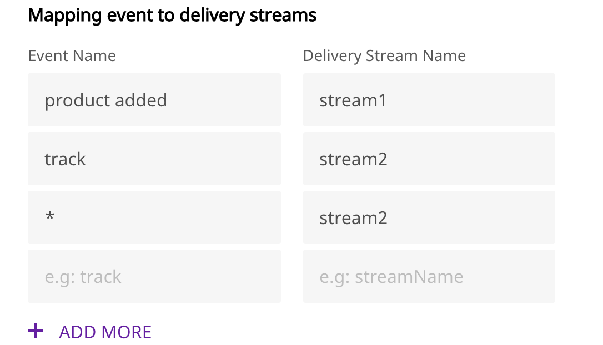

# Amazon Kinesis Firehose

[Amazon Kinesis Firehose](https://aws.amazon.com/kinesis/data-firehose/) gives you an easy and reliable way to load your streaming data into data lakes, data stores, and a host of other analytics tools. It is a fully-managed service that can be scaled automatically to match the load and throughput of your data, without requiring any additional administration. You can also perform batch processing, and compress, transform, and encrypt your data before loading it. Firehose helps you minimize the amount of storage used at the destination in a secure manner.

RudderStack allows you to configure Kinesis Firehose as a destination and send your event data to it directly.

## Getting Started

To enable sending data to Firehose, you will first need to add it as a destination to the source from which you are sending your event data. Once the destination is enabled, events from our SDK will start flowing to Firehose.

| **Connection Mode** | **Web** | **Mobile** | **Server** |
| :--- | :--- | :--- | :--- |
| **Device mode** | - | - | - |
| **Cloud mode** | **Supported** | **Supported** | **Supported** |


 To know more about the difference between Cloud mode and Device mode in RudderStack, read the [RudderStack connection modes](https://docs.rudderstack.com/get-started/rudderstack-connection-modes) guide.


Once you have confirmed that the platform supports sending events to Firehose, perform the steps below:

* From your [RudderStack dashboard](https://app.rudderlabs.com/), add the source. From the list of destinations, select **Firehose.**


Please follow our [Adding a Source and Destination](https://docs.rudderstack.com/getting-started/adding-source-and-destination-rudderstack) guide to add a source and destination in RudderStack.


* Give a name to the destination and click on **Next**. You should then see the following screen.
* Fill up the details and click on **Next** to complete the configuration. Firehose should now be added and enabled as a destination in RudderStack.


**Details to be filled:**

* **AWS Credentials**
  * **AWS Region**: Enter the AWS region here.
  * The **AWS Access Key ID** and **AWS Secret Access Key** are required ****to authorize RudderStack to write to your stream.


Please note that if the AWS credentials are **already configured** on your machine where the RudderStack server is set up, you will **not** need the security credentials.


* Enter the **Event Name** as well as the corresponding **Delivery Stream**.


You can send an event `type` like `page,` `identify,` `track`.   
For `track` events you can specify the event name based on the `event` name in the payload.

For example:

* If the event name is **`page`** it will send all the calls with `type` page.
* If event name is  **`product added`** , it will send all the track events with the **`event`** product added.



If you want to send all the events to a particular stream irrespective of the type or name, you can use **`*`** as the event name.



The **delivery stream** name is **case sensitive** and has to be exactly as named in AWS. On the other hand, the **event name** is **case insensitive**, and thus Page or page both will be considered.



The following snippet shows an example of a permissions policy that allows a user to put event data into Firehose:

```javascript
{
  "Version": "2012-10-17",
  "Statement": [
    {
      "Effect": "Allow",
      "Action": [
        "firehose:PutRecord"
      ],
      "Resource": [
        "arn:aws:firehose:{region}:{account-id}:stream/{stream-name}"
      ]
    }
  ]
}
```

## Adding Firehose Delivery Stream on Your AWS account

To configure the Firehose destination with RudderStack correctly, a delivery stream has to be created in Firehose. Please follow the steps below to do so:

* Follow these [instructions](http://docs.aws.amazon.com/firehose/latest/dev/basic-create.html) on how to create an Amazon Kinesis Data Firehose delivery stream.
* Next, create an IAM policy. To create one follow these instructions on [Creating an IAM policy](http://docs.aws.amazon.com/IAM/latest/UserGuide/access_policies_create.html).
* Add an IAM role and attach the policy which will allow `PutRecord` to interact with the delivery stream. To create an IAM role, follow the instructions on [Creating an IAM role](http://docs.aws.amazon.com/IAM/latest/UserGuide/id_roles_create_for-user.html#roles-creatingrole-user-console).

## FAQs

### How does event mapping work with the delivery stream?

* If there is no delivery stream set for an event, it will not be sent.
* If an event is set with a delivery stream, the payload will be sent to Firehose to that particular delivery stream.
* If you have set all event type, event and `*` for mapping the priority will be given to event  then type and then \*. Eg. Let the type of event be track, Event name be product added. And the mapping is done as:  



Then all events should go to the one mapped with `product added`.

##  Contact Us

If you come across any issues while configuring Kinesis Firehose with RudderStack, please feel free to [contact us](mailto:%20contact@rudderstack.com). You can also start a conversation on our [Slack](https://resources.rudderstack.com/join-rudderstack-slack) channel; we will be happy to talk to you!

