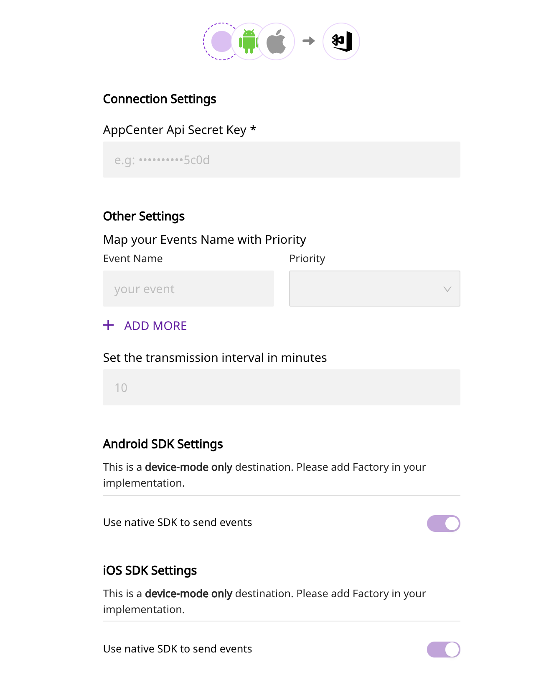

# App Center

[App Center](https://appcenter.ms/) is Microsoft's cross-platform build automation and management platform that lets you seamlessly manage your app's lifecycle. With App Center, you can easily manage and automate your builds, effectively test your apps in the cloud, and monitor their real-time usage with the help of crash data and analytics.

RudderStack lets you send your event data to App Center via its native web SDKs.

## Getting Started

Before configuring your source and destination on the RudderStack, please check whether the platform you are sending the events from is supported by App Center. Please refer the following table to do so:

| **Connection Mode** | **Web** | **Mobile**    | **Server** |
| :------------------ | :------ | :------------ | :--------- |
| **Device mode**     | -       | **Supported** | -          |
| **Cloud mode**      | -       | -             | -          |


To know more about the difference between Cloud mode and Device mode in RudderStack, read the [RudderStack connection modes](https://docs.rudderstack.com/get-started/rudderstack-connection-modes) guide.


Once you have confirmed that the platform supports sending events to App Center, perform the steps below:

- From your [RudderStack dashboard](https://app.rudderstack.com/), add the source and select **App Center** from the list of destinations.


Please follow our guide on [How to Add a Source and Destination in RudderStack](https://docs.rudderstack.com/how-to-guides/adding-source-and-destination-rudderstack) to add a source and destination in RudderStack.


- Name your destination, and click on **Next**. You should be able to see the following screen:



- Enter the relevant details and click on **Next** to complete the setup. The **API Secret Key** can be found as **App Secret** on the **Getting Started** page or **Settings** page on the App Center portal.



Follow these steps to add App Center to your Android project:

- Add the following `dependencies` to your `app/build.gradle` file as shown:

```groovy
implementation 'com.rudderstack.android.sdk:core:1.+'
implementation 'com.rudderstack.android.integration:appcenter:1.0.0'
implementation 'com.google.code.gson:gson:2.8.6'
```

- Also add the App Center `analytics` depedencies to your `app/build.gradle` as shown below:

```groovy
def appCenterSdkVersion = '4.1.0'
implementation "com.microsoft.appcenter:appcenter-analytics:${appCenterSdkVersion}"
```

- Make sure that the `minSdkVersion` in your `app/build.gradle` is atleast `21`.

```groovy
defaultConfig {
  minSdkVersion 21
}
```

- Finally, change the initialization of your `RudderClient` in your `Application` class, as shown:

```kotlin
val rudderClient = RudderClient.getInstance(
    this,
    <YOUR_WRITE_KEY>,
    RudderConfig.Builder()
        .withDataPlaneUrl(<YOUR_DATA_PLANE_URL>)
        .withFactory(AppcenterIntegrationFactory.FACTORY)
        .build()
)
```




Follow these steps to add App Center to your iOS project:

* Go your `Podfile` and add the `Rudder-AppCenter` extension

```ruby
pod 'Rudder-AppCenter'
```

* After adding the dependency followed by `pod install` , you can add the imports to your `AppDelegate.m` file, as shown:

```xcode
#import <RudderAppCenterFactory.h>
```

* Finally, change the initialization of your `RudderClient` as shown:

```xcode
RSConfigBuilder *builder = [[RSConfigBuilder alloc] init];
[builder withDataPlaneUrl:<YOUR_DATA_PLANE_URL>];
[builder withFactory:[RudderAppCenterFactory instance]];
[RSClient getInstance:<YOUR_WRITE_KEY> config:[builder build]];
```

The following requirements must be met to use App Center: Your iOS project is set up in Xcode 11 or later on macOS version 10.14.4 or later. You're targeting devices running on iOS 9.0 or later.




## Track

A `track` call lets you track custom events as they occur in your web application. For more information on the `track` call, please refer to the [RudderStack API Specification](https://docs.rudderstack.com/rudderstack-api-spec) documentation.

A sample `track` call looks like the following:

```xcode
[[RSClient sharedInstance] track:@"Product Clicked" properties:@{
    @"product_id" : @"pr01",
    @"name" : @"Cadbury"
}];
```


The above track call is directly passed on to App Center via its `trackEvent` api in both the RudderStack `Android` & `iOS` SDKs.


The `eventProperties` object should only contain the values of type `String` and `Number`- the other property types will be simply ignored, if sent.

For example, if eventProperties is set as:

```javascript
{
  "colours": [
    "red",
    "black"
  ],
  "city": "varkala",
  "state": "kerala"
}
```

then it will be sent to App Center as:

```javascript
{
  "city": "varkala",
  "state": "kerala"
}
```
## Screen

The `screen` method allows you to record whenever a user sees the mobile screen, along with any associated optional properties. This call is similar to the `page` call, but is exclusive to your mobile device.

A sample `screen` call using the RudderStack Android SDK looks like the following code snippet:

```xcode
[[RSClient sharedInstance] screen:@"Home" properties:@{
    @"category" : @"launcher"
}];
```

In the above snippet, RudderStack captures the information related to the screen being viewed, such as screen's name and category.


The above `screen` call is directly passed on to App Center as a `track` event via its `trackEvent` API, with event name as `Viewed {screen name} screen` along with the its properties. The above example will be sent as a `track` event with name `Viewed MainActivity screen` along with its properties.


## FAQs

### How do I get the App Center API secret?

The **API Secret Key** can be found as **App Secret** on the **Getting Started** page or **Settings** page on your App Center portal.

### What is transmission interval?

The App Center SDK uploads logs in a batch of 50. If the SDK doesn't have 50 logs to send, it will still send logs after 3 seconds (set by default). There can be a maximum of 3 batches sent in parallel. In this case, this interval of 3 seconds is the **transmission interval**. Note that the value of this transmission interval must always be between 3 seconds and 86400 seconds (one day).

## Contact Us

If you come across any issues while configuring App Center with RudderStack, please feel free to [contact us](mailto:%20docs@rudderstack.com). You can also start a conversation on our [Slack](https://resources.rudderstack.com/join-rudderstack-slack) channel; we will be happy to talk to you!
