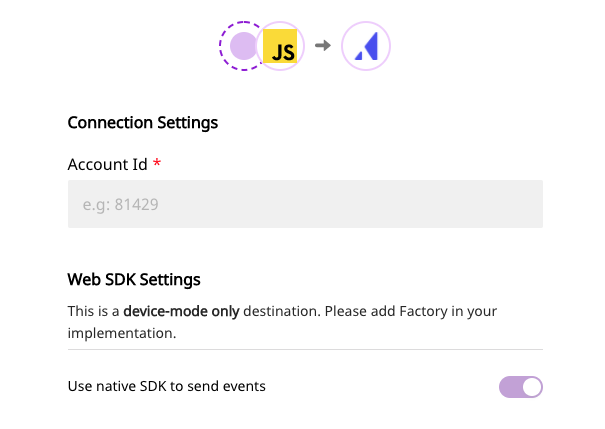

# Appcues

[Appcues](https://www.appcues.com/) makes it easy to deliver exceptional user experiences at scale, leading to happier customers and accelerated business growth. Using our Product-Led Growth Platform, anybody can publish beautiful and personalized in-product experiences in minutes, measure the impact on key business results, and know when and how to intervene with a human touchpoint.

RudderStack supports sending your event data to Appcues from our native web SDKs, to help you understand your customers better.

## Getting Started

Before configuring your source and destination on the RudderStack, please check whether the platform you are sending the events from is supported by Appcues. Please refer the following table to do so:

| **Connection Mode** | **Web** | **Mobile** | **Server** |
| :--- | :--- | :--- | :--- |
| **Device mode** | **Supported** | - | - |
| **Cloud mode** | - | - | - |


To know more about the difference between Cloud mode and Device mode in RudderStack, read the [RudderStack connection modes](https://docs.rudderstack.com/get-started/rudderstack-connection-modes) guide.


Once you have confirmed that the platform supports sending events to Appcues, perform the steps below:

* From your [RudderStack dashboard](https://app.rudderlabs.com/), add the source and select **Appcues** from the list of destinations.


Please follow our guide on [How to Add a Source and Destination in RudderStack](https://docs.rudderstack.com/how-to-guides/adding-source-and-destination-rudderstack) to add a source and destination in RudderStack.


* Name your destination, and click on **Next**. You should be able to see the following screen:



* Enter the relevant details and click on **Next** to complete the setup. To get the **API key** & **Account ID** field, please login to Appcues and navigate to **Settings** - **Account**. Here, copy the values of both API key & Account ID.


You need to make an identify call before making any call for Appcues


## Identify

The `identify` call is used to uniquely identify a user in Appcues. For more information on the `identify` call, please refer to the [RudderStack API Specification](https://docs.rudderstack.com/rudderstack-api-spec) documentation.

A sample `identify` call looks like the following snippet:

```text
rudderanalytics.identify("userId", userVars); // userVars is a JSON object
```

The above call is directly passed on to Appcues via its `Appcues.identify(userId,[properties])` call.

## Track

A `track` call lets you track custom events as they occur in your web application. For more information on the `track` call, please refer to the [RudderStack API Specification](https://docs.rudderstack.com/rudderstack-api-spec) documentation.

A sample `track` call looks like the following snippet:

```text
rudderanalytics.track("Clicked button", {
    color: "red",
    buttonText: "Get started"
});
```

The above call is directly passed on to Appcues via its `Appcues.track(eventName, [eventProperties])` call.

## Page

A page call contains information such as the URL or the name of the web page visited by the user. For more information, please refer to the [RudderStack API Specification](https://docs.rudderstack.com/rudderstack-api-spec) documentation.

A sample `page` call looks like the following:

```text
rudderanalytics.page("homepage");
```

The above call is directly passed on to Appcues via its `Appcues.page()` call.

Any additional properties passed to the `page` call are also passed on to Appcues.

Appcues will check to see if a user qualifies for an experience every time the page changes. When you first call page using rudderanalytics, Appcues checks if there are any current flows for the user and loads them if necessary.

## FAQs

### How do I get the Appcues API Key?

You can find the Appcues API key on the [Appcues Settings Page](https://studio.appcues.com/settings/account).

### How do I get the Appcues Account Id?

You can find the Appcues Account Id on the [Appcues Settings Page](https://studio.appcues.com/settings/account).

## Contact Us

If you come across any issues while configuring Appcues with RudderStack, please feel free to [contact us](mailto:%20contact@rudderstack.com). You can also start a conversation on our [Slack](https://resources.rudderstack.com/join-rudderstack-slack) channel; we will be happy to talk to you!
