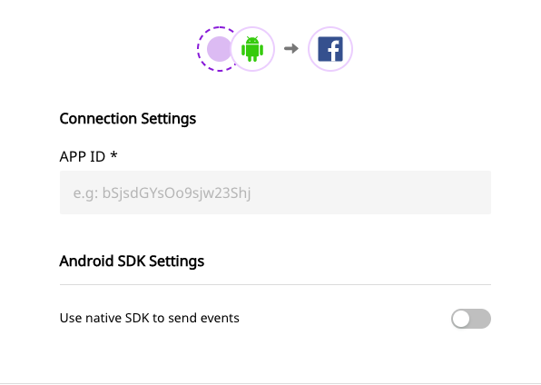

# Facebook App Events

[Facebook App Events](https://developers.facebook.com/docs/app-events/) allows you to track events via your app or web page. This includes activities such as a user installing the app, completing a purchase, and more. All these information is then used for analytics for better understanding your customer.

RudderStack supports sending your event data to Facebook App Events by adding it as a destination.

## Getting Started

To enable sending your event data to Facebook, you will first need to add it as a destination to the source from which you are sending your event data. Once the destination is enabled, events from our SDK will start flowing to Facebook.

Before configuring your source and destination on the RudderStack, please verify if the source platform is supported by Facebook, by referring to the table below:

| **Connection Mode** | **Web** | **Mobile** | **Server** |
| :--- | :--- | :--- | :--- |
| **Device mode** | - | **Supported** | - |
| **Cloud mode** | **Supported** | **Supported** | - |


To know more about the difference between Cloud mode and Device mode in RudderStack, read the [RudderStack connection modes](https://docs.rudderstack.com/get-started/rudderstack-connection-modes) guide.


Once you have confirmed that the platform supports sending events to Facebook, perform the steps below:

* From your [RudderStack dashboard](https://app.rudderlabs.com/), add the source. From the list of destinations, select **Facebook**.


Please follow our guide on [How to Add a Source and Destination in RudderStack](https://docs.rudderstack.com/how-to-guides/adding-source-and-destination-rudderstack) to add a source and destination in RudderStack.


* Give a name to the destination and click on **Next**. You should then see the following screen:



* Enter the **Facebook App Id**. 
* Turn on the `Use native SDK to send events` button so that we can send data to Facebook using the native SDK.
* Click on **Next** to complete the configuration. 

Facebook App Events should now be added and enabled as a destination in RudderStack.

## Adding Facebook App Events to your project

Depending on your platform of integration, follow these steps below to add Facebook to your project:



To add Facebook to your iOS project:

* Add the following line to your [CocoaPods](https://cocoapods.org/) `Podfile` 

```text
pod 'Rudder-Facebook', '0.1.1'
```

* After adding the dependency, you must register the `RudderFacebookFactory` with your `RudderClient` initialisation as a `factory` of `RudderConfig`. To do this, run the following command to import the `RudderFacebookFactory.h` file in your `AppDelegate.m` file.

```text
#import <Rudder-Facebook/RudderFacebookFactory.h>
```

* Then, change the SDK initialisation to the following:

```text
RSConfigBuilder *builder = [[RSConfigBuilder alloc] init];
[builder withDataPlaneUrl:DATA_PLANE_URL];
[builder withFactory:[RudderFacebookFactory instance]];
[RSClient getInstance:WRITE_KEY config:[builder build]];
```



To add Facebook App Events to your Android project:

* Add the repository as shown:

```text
repositories {
    maven { url "https://dl.bintray.com/rudderstack/rudderstack" }
}
```

* Add the following line to your `app/build.gradle` file under `dependencies` section:

```text
implementation 'com.rudderstack.android.sdk:core:1.0.2'
implementation 'com.rudderstack.android.integration:facebook:0.1.1'
implementation 'com.facebook.android:facebook-android-sdk:5.9.0'
```

* Finally change the initialization of your `RudderClient` in your `Application` class.

```text
val rudderClient = RudderClient.getInstance(
    this,
    WRITE_KEY,
    RudderConfig.Builder()
        .withDataPlaneUrl(DATA_PLANE_URL)
        .withFactory(FacebookIntegrationFactory.FACTORY)
        .build()
)
```



## Identify

The `identify` call from RudderStack sets the `userId` through the `setUserID` method from `AppEventsLogger` .

RudderStack sets the following properties \(if available\) using the `setUserData` method.

* `email`
* `firstName`
* `lastName`
* `phone`
* `birthday`
* `gender`
* `city`
* `state`
* `zip`
* `country`

A Sample `identify` call for an iOS application will look like the below.

```text
[[RSClient sharedInstance] identify:@"developer_user_id"
                                 traits:@{@"email": @"bar@foo.com"}];
```

## Track

The `track` call from RudderStack is logged to Facebook using `logEvent` method of the `AppEventsLogger` class. We'll use the `eventName` as same as you have passed to the `track` method. Along with that, we'll pass all the `properties` you've passed after converting it to the accepted format.

A Sample `track` call for an iOS application will look like the below.

```text
[[RSClient sharedInstance] track:@"Accepted Terms of Service" 
                          properties:@{
                                  @"foo": @"bar",
                              @"foo_int": @134
}];
```

## Screen

For all the `screen` calls from the SDK, RudderStack tracks that as `track` event to Facebook with the `eventName` as the name of the `screen` . All the properties are also passed to AppsFlyer as is.

RudderStack performs the same task for the automatically recorded `screen` calls as well. For those calls, a Boolean property called `automatic` is obtained in the properties.

## FAQs

### Where do I get the Facebook App Id?

You can find the **Facebook App Id** by logging into your Facebook Developer account, and navigating to the **Home** page of your Application dashboard.

## Contact Us

If you come across any issues while configuring Facebook App Events with RudderStack, please feel free to [contact us](mailto:%20contact@rudderstack.com) . You can also start a conversation on our [Slack](https://resources.rudderstack.com/join-rudderstack-slack) channel; we will be happy to talk to you!

