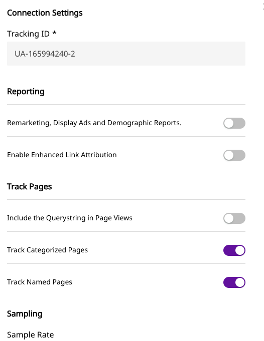
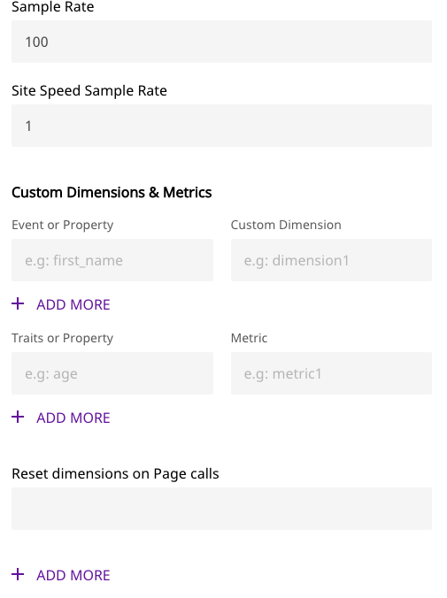
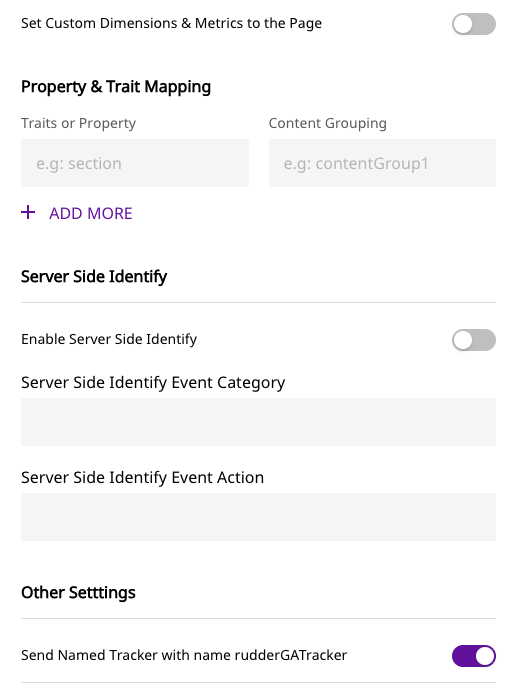
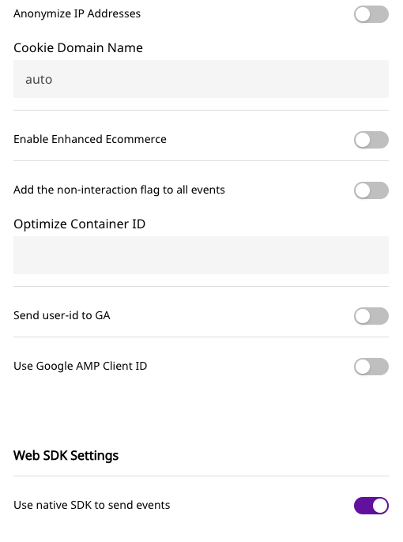
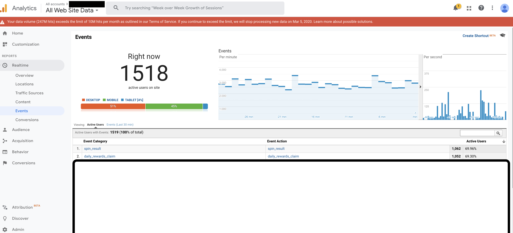
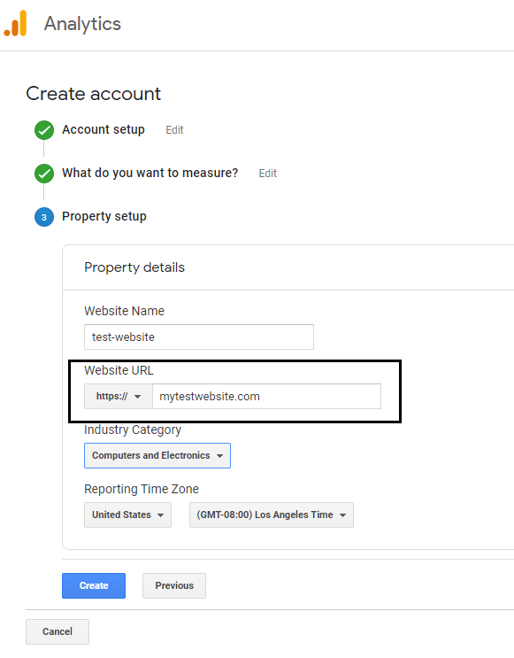

# Google Analytics

Google Analytics is the world's most popular analytics service that allows you to track and report your website traffic across a variety of sources.

RudderStack supports sending events from RudderStack SDKs to the Google Analytics endpoints. We support the connection mode **S2S** **\(Server-to-Server\)** through our data plane, making requests to Google Analytics endpoints through Google Analytics' **Measurement Protocol** specification.

## Getting Started

Before configuring your source and destination on the RudderStack app, please check whether the platform you are working on is supported by Google Analytics. Refer to the table below:

| **Connection Mode** | **Web** | **Mobile** | **Server** |
| :--- | :--- | :--- | :--- |
| **Device Mode** | **Supported** | - | - |
| **Cloud Mode** | **Supported** | **Supported** | **Supported** |


To know more about the difference between Cloud mode and Device mode in RudderStack, read the [RudderStack connection modes](https://docs.rudderstack.com/get-started/rudderstack-connection-modes) guide.


Once you have confirmed that the platform supports sending events to Google Analytics, perform the steps below:

To enable sending data to Google Analytics, you will first need to add it as a destination to the source from which you are sending the event data. 


Please follow our guide on [How to Add a Source and Destination in RudderStack](https://docs.rudderstack.com/how-to-guides/adding-source-and-destination-rudderstack) to add a source and destination in RudderStack.


Once the destination is enabled, events from our servers will start flowing to Google Analytics. You will start seeing the events in Google Analytics' real-time view.

Google Analytics' property `tracking id` is a required field to start sending events. Other inputs as shown below can be set as per your preferences:









## Page

We send a `pageview` hit to Google Analytics whenever you make a **`page()`** call from our SDKs.

From our JavaScript libraries, we automatically collect the following page properties with the **`page()`** call just after the **`load()`** call:

* `path`
* `url`
* `title`
* `search`
* `referrer`

> For a page loaded at [http://localhost/test\_browser.html?param1=true](http://localhost/test_browser.html?param1=true) with title "Page Load"

| Property | Value |
| :--- | :--- |
| `path` | /test\_browser.html |
| `referrer` | "" |
| `search` | ?param1=true |
| `title` | Page Load |
| `url` | [http://localhost/test\_browser.html?param1=true](http://localhost/test_browser.html?param1=true) |

You can also override these values and call `page()` with properties as shown below:

```bash
rudderanalytics.page({
  path: "path",
  url: "url",
  title: "title",
  search: "search",
  referrer: "referrer"
});
```


It is important to send a `path` or `url` property with page call, otherwise Google Analytics will silently reject the event.


There are other variants of the `page()` call that you can send, which involve giving your page's `name` and `category` :

```javascript
// Passing page category and name
rudderanalytics.page("category", "name", {
        path: "path",
        url: "url",
        title: "title",
        search: "search",
        referrer: "referrer"
}); 


// "home" is the name of the page. 
rudderanalytics.page("home", {
        path: "path",
        url: "url",
        title: "title",
        search: "search",
        referrer: "referrer"
}); 
```


For a server-side screen call, the application name is passed from RudderStack's `context.app.name` as **`an`**, otherwise the event will be rejected by GA. 

If **Include the Querystring in Page Views** option is turned on under Advanced options of RudderStack destination settings \(please refer to the settings in the Getting Started section above\), then the whole URL with query string will be sent as **`dp`** \(Document Path\). Otherwise, the query string will be removed from the URL.


## Identify

Personally Identifiable Information \(PII\) cannot be sent to the Google Analytics reporting interface. Thus nothing is passed to Google unless specifically told.

Google Analytics' universal tracking allows you to set a user ID to the identified visitors if **Send User ID** **to GA** is enabled in the destination settings by the user. Also, the `userid` property must be enabled in Google Analytics, and user-id view needs to be created.

A sample `identify` call is as shown:

```text
rudderanalytics.identify("abc123", {
        name: "Ruchira Moitra",
        email: "ruchira@gmail.com"
      });
```

In the above snippet, the `userid` will be set to `abc123` for Google Analytics, but the name and email will not be shared with Google. Traits along with custom dimensions, metrics, and content groupings can be set in the SDK.

For server-side, Google Analytics needs a customer identifier for each call to be made. RudderStack passes an internally generated ID as the `cid` parameter for Google Analytics to understand every unique user. Traits are not mapped to custom dimensions, metrics and content grouping yet from our side in server-side.

You can call `identify` once in order to set the `userId` and `user traits`for all subsequent calls that you make from our SDK for a particular user. If `userId` is not set, RudderStack sends a generated ID \(called `anonymousId`\) from its SDKs with every call made to the RudderStack servers. This `id` is used as the `cid` in Google Analytics. And if Send User ID to GA setting is enabled, the user ID property will be set as `uid` and will be sent as well.

## Custom Dimensions

In Google Analytics, we can configure custom dimensions in the [Admin](https://support.google.com/analytics/answer/6132368?hl=en) page.

There are multiple scopes for custom dimensions, such as `hits`, `session`, `user`, and `products` \(If Enhanced eCommerce is enabled\). Once these are set up in Google Analytics, the traits and properties can be mapped to custom dimensions as set by the user in the RudderStack destination settings page \(as seen in the Getting Started section\). 

A custom dimension should be set as `dimension{index}` . For example, `dimension1` and it will map accordingly when the user sets the dimension in GA settings as shown below.

Similar activity is to be done for metrics.A


An `identify` call with custom dimensions will be recorded after the next `track` or `page` call.

```text
rudderanalytics.identify({
Gender: 'Female'
});

rudderanalytics.track('Viewed History');
```

## Track

We send an `event` hit when a **`track()`** call is made from our SDKs.

A simple `track` call is as shown:

```text
rudderanalytics.track("Track me")
```

This will send the following `Event Category` and `Event Action` :

| Property | Value |
| :--- | :--- |
| Event Category | All |
| Event Action | `Track me` |


We do not populate the `Event Category` field by default. If you face such a requirement, use our custom transformations to populate the event payload with a `category` property.


A more verbose `track` call that you can make is as shown:

```text
rudderanalytics.track("Track me", {
        category: "category",
        label: "label",
        value: "value"
 });
```

The following properties are sent to the Google Analytics event:

| Property | Value |
| :--- | :--- |
| Event Category | `category` |
| Event Action  | `Track me` |
| Event Label | `label` |
| Event Value | `value` |

## Non-Interaction Events

If the non-interaction setting is enabled in the RudderStack destination settings, `nonInteraction` with value `1` will be sent. 

```text
{
  "action": "track",
  "event": "Track Page",
  "properties": {
    "nonInteraction": 1
  }
}
```

In Google Analytics, some events can be tagged as non-interaction events. On the server-side, it is set in `ni` .

## E-Commerce

RudderStack supports basic E-Commerce tracking for Google Analytics.

The required steps are:

* For every order completed, `orderId` is required. For each product in the order, there must be an `id` and `name`. Other properties are optional.
* The E-Commerce tracking should be enabled otherwise it will not be shown in the reports.

## Enhanced E-Commerce

Enhanced E-Commerce allows you to derive insights on the E-Commerce events by combining impression data, product data, promotion data and action data. This is a necessity for product-scoped custom dimensions.

Enhanced E-Commerce must be enabled in Google Analytics, and should follow RudderStack's [E-Commerce Tracking API](https://docs.rudderstack.com/rudderstack-api-spec/rudderstack-ecommerce-events-specification).

The required steps are:

* Similar to E-Commerce tracking, for every order completed the `orderId` is required. For each product, `id` and `name`are required.
* The product ID or name must be passed for all the events that has the product details. `product_id` will check if `properties.product_id` is present or not. Else `properties.sku`  will be picked.
* `order_id` is required for refunded orders.

To send Enhanced E-Commerce events, please enable it in the RudderStack destination settings page.

### Measuring Checkout Steps

The Checkout steps feature is a key difference between the regular E-Commerce and Enhanced E-Commerce tracking, and a major feature of the latter.

You can configure the checkout funnel in the Google Analytics admin interface as shown below:


The checkout flow can be implemented by calling `track` with **`checkout step viewed`** and **`checkout step completed`** for the steps you have added in Google Analytics. 

An example of this is as shown:

```text
rudderanalytics.track('checkout step viewed', {
            currency: 'CAD',
            step: 1
          });
rudderanalytics.track('checkout step completed', {
            currency: 'CAD',
            step: 1,
            //if this is the shipping step
            shippingMethod: 'FedEx',
            //if this is the payment step
            paymentMethod: 'Visa
          });
```


For more information, please check our guide on the [RudderStack E-Commerce Events Specification](https://docs.rudderstack.com/rudderstack-api-spec/rudderstack-ecommerce-events-specification).


### Measuring Promotions

```text
rudderanalytics.track('promotion viewed', {
            currency: 'CAD',
            promotion_id: 'PROMO_1234',
            name: 'Winter Sale',
            creative: 'winter_banner2',
            position: 'banner_slot1',
            testDimension: true,
            testMetric: true
          });
rudderanalytics.track('promotion clicked', {
            currency: 'CAD',
            promotion_id: 'PROMO_1234',
            name: 'winter Sale',
            creative: 'winter_banner2',
            position: 'banner_slot1',
            testDimension: true,
            testMetric: true
          });
```

### Coupons

You can add the `coupon` property if you want to send coupon data to **`order completed`**.

```text
rudderanalytics.track('order completed', {
            orderId: 'abc55',
            total: 999.9,
            shipping: 23.99,
            tax: 25.99,
            currency: 'CAD',
            coupon: 'coupon',
            affiliation: 'affiliation',
            testDimension: true,
            testMetric: true,
            products: [
              {
                quantity: 1,
                price: 24.75,
                name: 'rudder product',
                category: 'cat 1',
                sku: 'p-298',
                productDimension: 'testing'
              },
              {
                quantity: 3,
                price: 24.75,
                name: 'other product',
                category: 'cat 2',
                sku: 'p-299',
                currency: 'EUR',
                productDimension: 'testing'
              }
            ]
          });
```

### Measuring Product Impressions

Information related to impressions of the users who have viewed or filtered through the product can be collected through Enhanced E-Commerce. The product impressions are mapped to **`product list viewed`** and **`product list filtered`** events.

```text
window.rudderanalytics.track('product list filtered', {
            category: 'cat 1',
            list_id: '1234',
            filters: [
              {
                type: 'department',
                value: 'beauty'
              },
              {
                type: 'price',
                value: 'under'
              }
            ],
            sorts: [
              {
                type: 'price',
                value: 'desc'
              }
            ],
            products: [
              {
                product_id: '507f1f77bcf86cd799439011',
                productDimension: 'My Product Dimension',
                productMetric: 'My Product Metric'
              }
            ],
            testDimension: true,
            testMetric: true
          });
window.rudderanalytics.track('Product List Viewed', {
            category: 'cat 1',
            list_id: '1234',
            products: [
              {
                product_id: '507f1f77bcf86cd799439011',
                productDimension: 'My Product Dimension1',
                productMetric: 'My Product Metric1',
                position: 10
              },
              {
                product_id: '507f1f77bcf86cd799439012',
                productDimension: 'My Product Dimension2',
                productMetric: 'My Product Metric2',
                position: 12
              },
              {
                product_id: '507f1f77bcf86cd799439015',
                productDimension: 'My Product Dimension3',
                productMetric: 'My Product Metric3',
                position: 8
              }
            ]
          });
```

### Refunds

For full refunds :

```text
 rudderanalytics.track('order refunded', {
            order_id: 'abc55',
            testDimension: true,
            testMetric: true
          });
```

For partial refunds:

```text
rudderanalytics.track('order refunded', {
            order_id: 'abc55',
            products: [
              {
                quantity: 1,
                sku: 'p-1'
              },
              {
                quantity: 2,
                sku: 'p-2'
              }
            ],
            testDimension: true,
            testMetric: true
          });
```

## Passing Cookies from Universal Analytics

`clientId` \(cid\) is used to keep a track of the unique visitors to your website.

A Google Analytics universal cookie will look like the following:

```text
_ga=GA1.2.476220681.159039102;
```

The `clientId` is `476220681.159039102` which can be cross-checked by running the following snippet:

```text
ga(function (tracker) {
    var clientId = tracker.get('clientId');
    console.log('My GA universal client ID is: ' + clientId);
});
```

On the server-side, if `clientId` is passed manually by sending `anonymousId`. If the **Send User ID** setting is enabled in the destination settings along with `cid` , `uid` will be sent where `userId` will be passed.

## User Agent

On the server-side, `user_agent` is set from `context.userAgent`.

## Visitor Geo Location

On the client-side tracking, the IP address of the HTTP request is sent automatically to determine the location of the visitor. However, on the server-side, the visitor's IP has to be included in the `track` call.

## UTM Parameters

The UTM parameters need to be passed manually to the server. 

UTM parameters are passed in the context object in `context.campaign`. `campaign.name` and `campaign.mediums` must be sent together to show up in the report. Also, `campaign.term` and `campaign.content` are optional.

## Additional Features

There are some other important features associated with Google Analytics integration, as described in the sections below:

### Named Tracker

If you turn on the named tracker in RudderStack destination setting under the **Other Settings** option, Rudder will push the events to a GA tracker named as `rudderGATracker`  instead of the default tracker.  
For more information on creating trackers please follow:

[https://developers.google.com/analytics/devguides/collection/analyticsjs/creating-trackers](https://developers.google.com/analytics/devguides/collection/analyticsjs/creating-trackers)

If it is turned off default tracker which is internally given the name `t0` will be set. 

#### Multiple Trackers

A 2nd tracker can be set in the ready callback function of RudderStack SDK.

An example of sending events to GA with another tracking id:

```javascript
// without any tracker name
window.rudderanalytics.ready(() => {
      console.log("we are all set!!!");
      window.ga('create', 'UA-XXXXXXX-1', 'auto');
      window.ga('send', 'pageview');
});
      
// with a tracker name
window.rudderanalytics.ready(() => {
      console.log("we are all set!!!");
      window.ga(
            'create', 
            'UA-XXXXXXX-1', 
            'auto', 
            { 'name': 'newTracker' }
      );
      window.ga('newTracker.send', 'pageview');
});
```

### Anonymize IP Address

You can turn on **Anonymize IP Address** in the RudderStack destination settings under the **Other Settings** option. Once this setting is enabled, Google Analytics anonymizes the address at the earliest possible stage of the collection network.

### Cookie Domain Name

The default value of this is set to `auto` . However, you can change it in the destination settings. You can get more information on this feature by referring to  [Google documentation](https://developers.google.com/analytics/devguides/collection/analyticsjs/domains). 

### Cross-domain Tracking

There are two ways to do this:

* Tracking visitors with `userid`: If the **Send User ID** destination setting is enabled, it will be sent to identify the user, However, this only works for the identified users. Anonymous visitor sessions will not be maintained.
* Tracking Anonymous Visitors: `allowLinker` is enabled automatically by RudderStack as Google Analytics provides an auto-linking plugin that allows you to track cookies and anonymous visitors when moving from one page to the other.

### Ignored Referrers

For Universal profiles, this can be edited in Google Analytics directly.

### Remarketing

This feature is used to tag visitors for remarketing campaign. Enable the **Remarketing, Display Ads and Demographic Reports** option in the **Reporting** section of the destination settings to utilize this feature.

### Site Search

When someone searches the site, the search term has to be added to the URL query. This feature comes in handy in such a case.

To enable this feature, turn on **Include the Querystring in page views** option in the destination settings

In your Google Analytics account, enable **Site search Tracking** and put the parameter query.

If the query is `abc.com/s=xyz`the setting should be as follows:


### Optimize

Add your **Optimize Container ID** in destinations settings. 

### Content Groupings

You can set the content group mapping in the RudderStack dashboard and Google Analytics, as shown in the images below:


When you use `rudderanalytics.page(name, properties)` with the custom properties, RudderStack will use the value of the property you designate as the value of the specified content grouping.


For more information on content grouping, please refer to this [guide](https://support.google.com/analytics/answer/2853423?hl=en#:~:text=Content%20Grouping%20lets%20you%20group,page%20title%2C%20or%20screen%20name.).


### Sample Rate

This feature specifies what percentage of users should be tracked. The default value is set to be 100.

### Site Speed Sample Rate

This feature defines the sample size for Site Speed data collection. The default value is set to 1.

### Server-side Identification 

If enabled, the `identify` calls will be made only from the server-side.

### Server-side Identification Event Action and Category.

If any action is specified, it will go as `ea` otherwise it will default to `User Enriched`

If any category is specified, it will go as `ec` otherwise it will default to `All`

### AMP Client ID

If enabled, Google’s AMP Client ID API will uniquely identify users who engage with your content on the AMP and non-AMP pages.

### Reset Dimension On page call

If the specified dimension is set in the properties of the `page` call, it will be reset to null and a new value will be set.

## FAQs

### Where can I find the tracking ID?

The tracking ID can be found in your Google Analytics account:


Navigate to your account and go to Apps. The tracking ID will be present there.

### What are custom metrics and custom dimensions?

**Custom metrics** and **custom dimensions** are fields that allow you to track custom properties associated with your events using RudderStack.

Metrics is for event properties having numeric data type while dimensions is for event properties having string data type. Both are used to track custom data properties in Google Analytics.

Please refer to the [Getting Started](https://docs.rudderstack.com/destinations-guides/google-analytics-ga#getting-started) section above in this document to know how to specify these fields on the RudderStack platform.

### My website uses HTTPS. Do I need to change any settings for accurate Google Analytics tracking?

Yes. In the **Property Setup**, please change the website URL from HTTP \(default\) to HTTPS as shown:


### Can I view real-time reports of my event data?

Yes, you can. Please check the Real-time reports in Google Analytics. A sample dashboard is as shown:



### How do I view the already processed events for a particular day?

Please adjust the Google Analytics' default reporting time frame from a month ago to **the required date**, in order to view the processed events of that day.




### Why are my page views in Google Analytics different when sent from device mode as against the cloud mode?

There could be 2 reasons for this:

* There can be ad blockers enabled in the user's browser while visiting your site. This blocks the Google Analytics requests from being sent directly from the browser.
* For the cloud mode, RudderStack is not blocked by ad blockers presently. If the events are sent to Google Analytics via the cloud mode, the actual number of events intended to be sent to Google Analytics are forwarded by the RudderStack server. So, the number of requests from the native mode or device mode is expected to be lower than cloud mode.

The RudderStack JavaScript SDK provides a way of detecting how many page view requests are potentially being blocked by the ad blockers throughout your site pages. Please check the section on [Detecting Ad-blocked Pages](https://docs.rudderstack.com/rudderstack-sdk-integration-guides/rudderstack-javascript-sdk#detecting-ad-blocked-pages) for more information.

## Contact Us

If you come across any issues while configuring Google Analytics with RudderStack, please feel free to [contact us](mailto:%20contact@rudderstack.com). You can also start a conversation on our [Slack](https://resources.rudderstack.com/join-rudderstack-slack) channel; we will be happy to talk to you!

