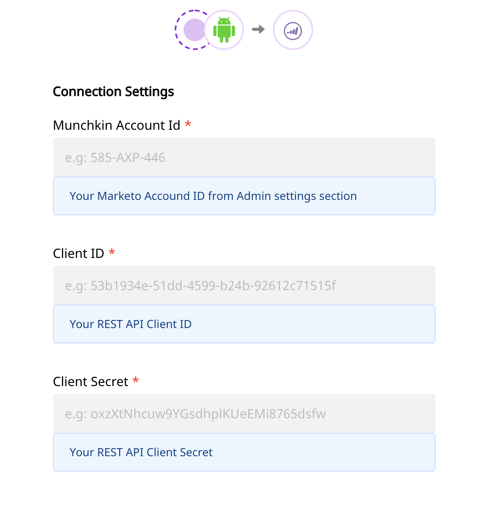

# Marketo

[Marketo](https://marketo.com) is most often used by medium-sized businesses and offers bundles for focusing on lead management, email marketing, consumer marketing, customer base marketing and mobile marketing. It offers customized products for several industries, including technology, healthcare, media, higher education and manufacturing.

RudderStack allows you to seamlessly configure Marketo as a destination to which you can send your event data seamlessly.

## Getting Started

To enable sending data to **Marketo**, you will first need to add it as a destination to the source from which you are sending your event data. Once the destination is enabled, events from RudderStack will start flowing to Marketo.

Before configuring your source and destination on the RudderStack, please verify if the source platform is supported by Marketo, by referring to the table below:

| **Connection Mode** | **Web** | **Mobile** | **Server** |
| :--- | :--- | :--- | :--- |
| **Device mode** | **-** | - | - |
| **Cloud mode** | **Supported** | **Supported** | **Supported** |


To know more about the difference between Cloud mode and Device mode in RudderStack, read the [RudderStack connection modes](https://docs.rudderstack.com/get-started/rudderstack-connection-modes) guide.


Once you have confirmed that the platform supports sending events to Marketo, please perform the steps below:

* Choose a source to which you would like to add Marketo as a destination.


Please follow our [Adding a Source and Destination](https://docs.rudderstack.com/how-to-guides/adding-source-and-destination-rudderstack) guide to know how to add a source in RudderStack.


* Select the destination as **Marketo** to your source. Give your destination a name and then click on **Next**.
* On the **Connection Settings** page, fill all the fields with the relevant information and click **Next**



### Configurable settings

The following are the settings to be configured:

* **Munchkin Account ID**: You can find the ID on the Munchkin page under Integration on your Admin settings page.
* **Client ID**: To get the ID navigate to the LaunchPoint page under Integration on your Admin settings page. Then select the API service and click on "View Details".
* **Client Secret**: You can find the secret next to the ID from the previous step


You need to create two fields in Marketo with API names exactly as `userId` and `anonymousId`. We lookup the Lead objects using these properties. Without these two fields all the events will fail.


## Track

We register a custom activity to Marketo for the `track` calls. You need to create the map of the events you want to send through RudderStack to the custom activity ID you have received on your Marketo dashboard. For every custom activity, Marketo needs a Primary Key value. You need to create the map of `properties` field and the event name where you intend to send the value of the Primary Key for that event. For the other `properties` you need to create a mapping between the name you want to send to marketo and your `properties` field name from your source.

A sample `track` call is as shown in the snippet below:

```javascript
rudderanalytics.track("Order Completed", {
  checkout_id: "C324532",
  order_id: "T1230",
  value: 15.98,
  revenue: 16.98,
  shipping: 3.0,
  coupon: "FY21",
  currency: "INR"
});
```

## Identify

We create or update a Lead object in Marketo through an `identify` request. By default we map the following `traits` to relevant fields in Marketo. For rest of the fields you want to sync with Marketo, you need to create a mapping of your `traits` field name and the `customFieldName` from your Marketo dashboard.

| Marketo Field Name | RudderStack Trait Name |
| :--- | :--- |
| `City` | `address.city` |
| `Company` | `company.name` |
| `Country` | `address.country` |
| `Email` | `email` |
| `FirstName` | `firstName` |
| `Industry` | `company.industry` |
| `LastName` | `lastName` |
| `OriginalSourceInfo` | `leadSource` |
| `NumberOfEmployees` | `company.employee_count` |
| `Phone` | `phone` |
| `PostalCode` | `address.zip` |
| `Rating` | `rating` |
| `State` | `address.state` |
| `Address` | `address.street` |
| `Title` | `title` |
| `DateofBirth` | `birthday` |
| `Website` | `website` |

A sample `identify` call is as shown:

```javascript
rudderanalytics.identify("name123", {
  name: "Name Surname",
  first_name: "Name",
  last_name: "Surname",
  email: "name@surname.com",
  createdAt: "Thu Mar 24 2020 17:46:45 GMT+0000 (UTC)",
});
```

## FAQs

### Why my request are failing saying Lookup failed?

Please make sure that you've created two fields in Marketo with the names `userId` and `anonymousId` so that we can lookup the Lead database for `leadId` with the `userId` passed along with the event.

### Why my track events are failing?

Please check whether you've turned off the `Track Anonymous Id` settings on the dashboard. If the setting is turned off, and you are not sending an `userId` along with your event the events will fail.

## Contact Us

If you come across any issues while configuring or using Indicative with RudderStack, please feel free to [contact us](mailto:%20contact@rudderstack.com). You can also start a conversation on our [Slack](https://resources.rudderstack.com/join-rudderstack-slack) channel; we will be happy to talk to you!


