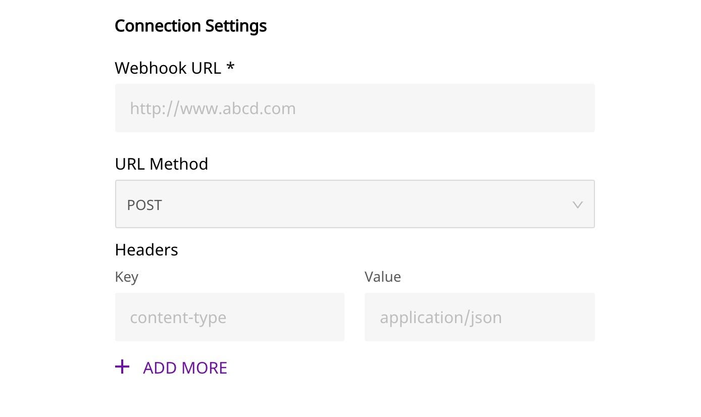
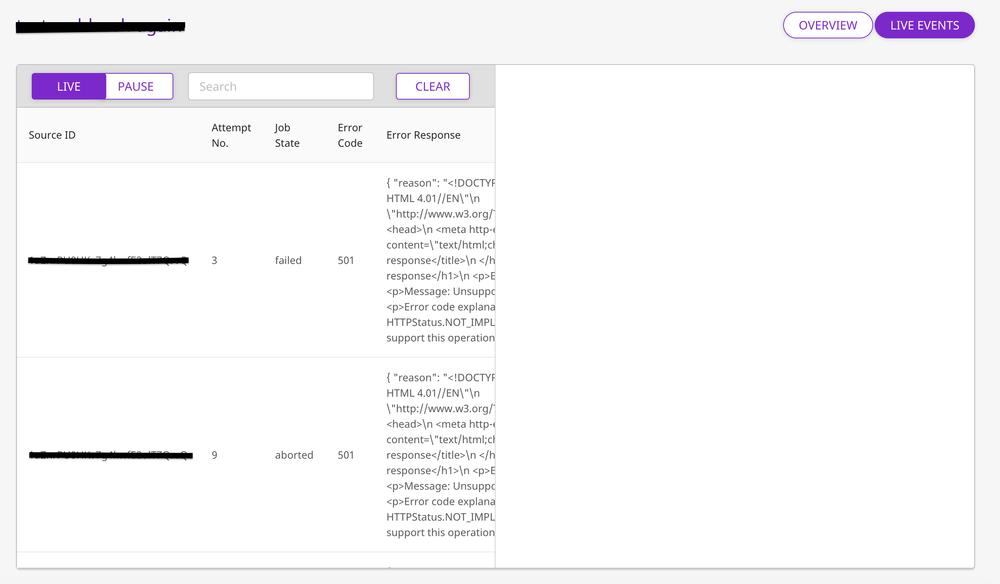

# Webhooks

Webhooks allow you to send events generated via the RudderStack SDK to your own backend. It is useful for cases where you want to apply some custom logic on the payload before sending it to the destination platforms of your choice. 

Once enabled, RudderStack forwards the SDK events to your configured webhook endpoint.

## Getting Started

In order to collect your events at the webhook endpoint, you will first need to add it as a destination to the source from which you are sending event data. Once the destination is enabled, events from [RudderStack](https://github.com/rudderlabs/rudder-server) will start to flow to the webhook endpoint.

Before configuring your source and destination on the [RudderStack ](https://app.rudderstack.com/)[dashboard](https://app.rudderstack.com/), please check whether the platform you are working on is supported by referring to the table below:

| **Connection Mode** | **Web** | **Mobile** | **Server** |
| :--- | :--- | :--- | :--- |
| **Device mode** | - | - | - |
| **Cloud mode** | **Supported** | **Supported** | **Supported** |


To know more about the difference between Cloud mode and Device mode in RudderStack, read the [RudderStack connection modes](https://docs.rudderstack.com/get-started/rudderstack-connection-modes) guide.


Once you have confirmed that your platform supports sending events to webhooks, perform the steps below:

* Choose a source to which you would like to add your webhook endpoint as a destination.


Please follow our guide on [How to Add a Source and Destination in RudderStack](https://docs.rudderstack.com/how-to-guides/adding-source-and-destination-rudderstack) to add a source and destination in RudderStack.


* Select the destination as **Webhook** to your source. Give your destination a name and then click on **Next**.
* Next, in the **Connection Settings**, ****fill all the fields with the relevant information and click **Next**



* **Webhook URL:** This is the endpoint where [RudderStack](https://github.com/rudderlabs/rudder-server) will send the events. Both `http` and `https` are supported. For `https` , the **TLS cert** needs to be **valid** for successful event delivery.
* **URL Method:** This is the HTTP method of the request that would be sent to the configured endpoint. Supported methods - `POST` and `GET`. The default method is `POST`.
* **Headers:** Add custom headers for your events, these headers will be added to the request made from [RudderStack](https://github.com/rudderlabs/rudder-server) to your webhook. It by default adds the following headers for a `POST` request:

|   Key | Value |
| :--- | :--- |
| `User-Agent` | `RudderLabs` |
| `Content-Type` | `application/json` |

## Identify

The `identify` call is used to associate a user to their actions. Apart from capturing a unique user ID, you can also send optional traits associated with that user, such as name, email, IP address, etc using RudderStack SDKs.

A sample `identify` payload is as shown:

```javascript
{
  "channel": "web",
  "context": {
    "app": {
      "build": "1.0.0",
      "name": "RudderLabs JavaScript SDK",
      "namespace": "com.rudderlabs.javascript",
      "version": "1.1.1-rc.2"
    },
    "traits": {
      "name": "User name",
      "email": "user@domain.com",
      "plan": "Enterprise",
      "company": { "id": "company-A" },
      "createdAt": "Thu Mar 24 2016 17:46:45 GMT+0000 (UTC)"
    },
    "library": { "name": "RudderLabs JavaScript SDK", "version": "1.1.1-rc.2" },
    "userAgent": "Mozilla/5.0 (Macintosh; Intel Mac OS X 10_14_6) AppleWebKit/537.36 (KHTML, like Gecko) Chrome/80.0.3987.149 Safari/537.36",
    "locale": "en-US",
    "os": { "name": "", "version": "" },
    "screen": { "density": 1.600000023841858 },
    "page": {
      "path": "/tests/html/script-test.html",
      "referrer": "http://localhost:1111/tests/html/",
      "search": "",
      "title": "",
      "url": "http://localhost:1111/tests/html/script-test.html"
    }
  },
  "type": "identify",
  "messageId": "508d5e8c-96e4-4301-bd46-1890dba5c866",
  "originalTimestamp": "2020-04-22T08:06:20.337Z",
  "anonymousId": "21b43de4-3b9b-423f-b51f-794eae31fc03",
  "userId": "my-user-id",
  "integrations": { "All": true },
  "sentAt": "2020-04-22T08:06:20.337Z"
}

```

For each identify call, we send the request in the following manner\(depending on the URL Method you configured earlier\):

* **`POST`:** We send the whole event payload\(as shown above\) as the JSON body of the POST request.
* **`GET`:** We send the traits that you pass in the identify call as query params of the GET request. If your traits contain nested values, we flatten these values and send them as query params. For example, the company id specified in the above payload's traits is sent as `"company.id": "company-A"` 

## Page

The `page` call allows you to record your website's page views, with the additional relevant information about the page being viewed. For more information on the page call, please refer to the [RudderStack API Specification](https://docs.rudderstack.com/rudderstack-api-spec) guide.

A sample `page` payload is as shown:

```javascript
{
  "channel": "web",
  "context": {
    "app": {
      "build": "1.0.0",
      "name": "RudderLabs JavaScript SDK",
      "namespace": "com.rudderlabs.javascript",
      "version": "1.1.1-rc.2"
    },
    "traits": {},
    "library": { "name": "RudderLabs JavaScript SDK", "version": "1.1.1-rc.2" },
    "userAgent": "Mozilla/5.0 (Macintosh; Intel Mac OS X 10_14_6) AppleWebKit/537.36 (KHTML, like Gecko) Chrome/80.0.3987.149 Safari/537.36",
    "locale": "en-US",
    "os": { "name": "", "version": "" },
    "screen": { "density": 1.600000023841858 },
    "page": {
      "path": "/tests/html/script-test.html",
      "referrer": "http://localhost:1111/tests/html/",
      "search": "",
      "title": "",
      "url": "http://localhost:1111/tests/html/script-test.html"
    }
  },
  "type": "page",
  "messageId": "97114191-e2f2-42af-97db-14b358b1cfe1",
  "originalTimestamp": "2020-04-22T08:06:20.334Z",
  "anonymousId": "57d95a96-61dc-47bf-8f96-5d37543d7438",
  "userId": "user@domain.com",
  "properties": {
    "path": "/tests/html/script-test.html",
    "referrer": "http://localhost:1111/tests/html/",
    "search": "",
    "title": "",
    "url": "http://localhost:1111/tests/html/script-test.html",
    "experiment": {"variant": "old"}
  },
  "integrations": { "All": true },
  "sentAt": "2020-04-22T08:06:20.334Z"
}

```

For each page call, we send the request in the following manner\(depending on the URL Method you configured earlier\):

* **`POST`:** We send the whole event payload\(as shown above\) as the JSON body of the POST request.
* **`GET`:** We send the properties that you pass on the page call as query params of the GET request. If your properties contain nested values, we flatten these values and send them as query params. For example, the experiment variant specified in the above payload's properties is sent as `"experiment.variant": "old"`.

## Track

The `track` call captures all the activities that the user performs, along with any other properties that are associated with those activities. Each of these activities or actions is considered by RudderStack as an **event**. For more information on the track call, please refer to the [RudderStack API Specification](https://docs.rudderstack.com/rudderstack-api-spec) guide.

A sample `track` payload is as shown:

```javascript
{
  "channel": "web",
  "context": {
    "app": {
      "build": "1.0.0",
      "name": "RudderLabs JavaScript SDK",
      "namespace": "com.rudderlabs.javascript",
      "version": "1.1.1-rc.2"
    },
    "traits": {
      "name": "User name",
      "email": "user@doamin.com",
      "plan": "Enterprise",
      "company": { "id": "comapny-A" },
      "createdAt": "Thu Mar 24 2016 17:46:45 GMT+0000 (UTC)"
    },
    "library": { "name": "RudderLabs JavaScript SDK", "version": "1.1.1-rc.2" },
    "userAgent": "Mozilla/5.0 (Macintosh; Intel Mac OS X 10_14_6) AppleWebKit/537.36 (KHTML, like Gecko) Chrome/80.0.3987.149 Safari/537.36",
    "locale": "en-US",
    "os": { "name": "", "version": "" },
    "screen": { "density": 1.600000023841858 },
    "page": {
      "path": "/tests/html/script-test.html",
      "referrer": "http://localhost:1111/tests/html/",
      "search": "",
      "title": "",
      "url": "http://localhost:1111/tests/html/script-test.html"
    }
  },
  "type": "track",
  "messageId": "04a303b1-a466-4e66-9022-2a24edaca4fc",
  "originalTimestamp": "2020-04-22T08:06:20.338Z",
  "anonymousId": "21b43de4-3b9b-423f-b51f-794eae31fc03",
  "userId": "my-user-id",
  "event": "Product Purchased",
  "properties": {
    "order_ID": "1",
    "category": "boots",
    "product_name": "new_boots",
    "price": 60,
    "currency": "USD"
  },
  "integrations": { "All": true },
  "sentAt": "2020-04-22T08:06:20.338Z"
}
```

To view the other events and detailed event structure for the types of events being sent, please check our [RudderStack API Specification](https://docs.rudderstack.com/rudderstack-api-spec) documentation.

For each track call, we send the request in the following manner\(depending on the URL Method you configured earlier\):

* **`POST`:** We send the whole event payload\(as shown above\) as the JSON body of the POST request.
* **`GET`:** We send the properties that you pass in the track call as query params of the GET request. If your properties contain nested values, we flatten these values before sending them.

## FAQs

### How to check if there are any delivery failures for the events sent to the webhook?

* Login to your account in  [RudderStack app](https://app.rudderstack.com)
* Verify that you are sending the events in the **Live Events** tab of your source.
* Check if there are any delivery failures in the **Live Events** tab of your destination.



## Contact Us

If you come across any issues while configuring webhooks with RudderStack, please feel free to [contact us](mailto:%20contact@rudderstack.com). You can also start a conversation on our [Slack](https://resources.rudderstack.com/join-rudderstack-slack) channel; we will be happy to talk to you!

