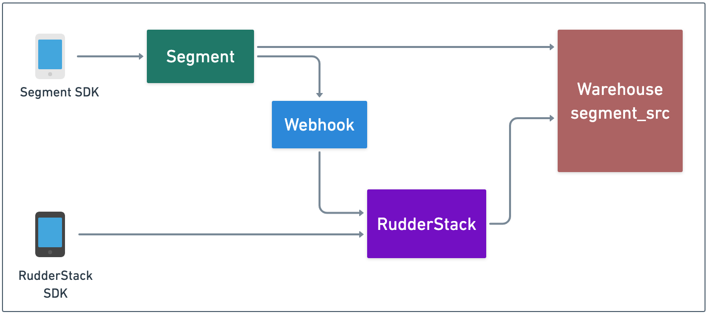

# Migrating Your Warehouse Destination from Segment to RudderStack

The RudderStack warehouse table schemas are fully compatible with Segment. You can start routing new events to your existing warehouse tables through RudderStack, without losing any historical data.

This guide lists the steps and best practices for switching over your warehouse destinations from Segment to RudderStack.

## Migrating Server-side Sources

Since we can predictably and reliably upgrade all the backend services, switching over server-side sources is simpler, as compared to the client-side sources.

### **Step 1: Create a Warehouse Destination in RudderStack**

Create a new warehouse destination and set the namespace to be the same as the schema that Segment is writing to. RudderStack will then write to the same set of tables as Segment.


Please follow our [Adding a Source and Destination](https://docs.rudderstack.com/getting-started/adding-source-and-destination-rudderstack) guide to know how to add a destination in RudderStack.


### **Step 2: Route new events to RudderStack**

Follow these steps:

1. Switch all the server-side clients to route your event data to RudderStack
2. Any events that are pending at Segment will be routed into your warehouse
3. RudderStack will then start routing new events into your warehouse


If both Segment and RudderStack try to write to the same tables at the same time, it could result in Serializable isolation errors in some warehouses like Redshift. This is an intermittent issue, and would succeed on retrying.


## Migrating Client-side Sources

There could be a scenario where some clients which are still using the old version of your application \(e.g. Android / iOS\) and sending the events to Segment.

Follow the below steps to easily migrate to RudderStack and storing the event data in the same tables as Segment.

### **Step 1: Create a Warehouse Destination in RudderStack**

* Create a new warehouse destination and set the namespace to be the same as the schema that Segment is writing to. RudderStack will then write to the same set of tables as Segment.

### **Step 2: Create a Segment Source in RudderStack**

* Create a new source of type `Segment`. This is to collect events from users who are still sending events to Segment.
* Copy the webhook URL. Replace `<DATA_PLANE_URL>` with your data plane URL.

### **Step 3: Create a Webhook destination in Segment**

* Create a new webhook destination to the source where your data warehouse is connected.
* Configure the webhook URL in the webhook settings.
* Once the sync intervals are configured, as mentioned in the **Step 4** below, the webhook destination should be enabled.


Please follow our [Adding a Source and Destination](https://docs.rudderstack.com/getting-started/adding-source-and-destination-rudderstack) guide to know how to add a source and destination in RudderStack.


### **Step 4:** **Configure Warehouse Sync Interval in RudderStack**

Some important points to note here:

* We want to capture all events in RudderStack and load them **after the final switchover**.
* Configure RudderStack's warehouse destination such that it will start syncing your data **after** Segment's warehouse load completes. For example, if Segment is going to finish loading the latest batch at 10 PM, then RudderStack's warehouse loading should start after that. \(10.30 PM, or 11 PM, and so on\).


If both Segment and RudderStack try to write to the same tables at the same time, it could result in Serializable isolation errors in some warehouses like Redshift. This is an intermittent issue, and should succeed after retrying.


### **Step 5: Disable Warehouse Destination in Segment**

* Once the latest Segment's warehouse load is complete, we can disable Segment's warehouse destination. RudderStack will have the events from the webhook, they will be de-duplicated when uploaded to the warehouse.
* RudderStack will keep loading new events as per the configured schedules.

### **Step 6: Disable Webhook Destination in Segment**

* Once all clients are migrated over to RudderStack, you can disable the webhook destination in Segment.

## Contact Us

If you come across any issues while migrating your warehouse destinations from Segment to RudderStack, please feel free to [contact us](mailto:%20contact@rudderstack.com). You can also start a conversation on our [Slack](https://resources.rudderstack.com/join-rudderstack-slack) channel; we will be happy to talk to you!

