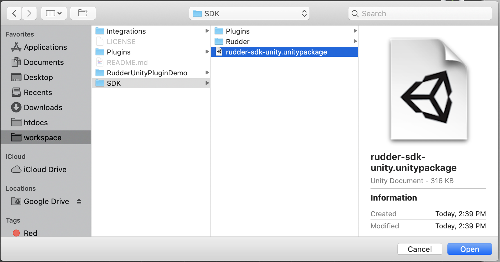
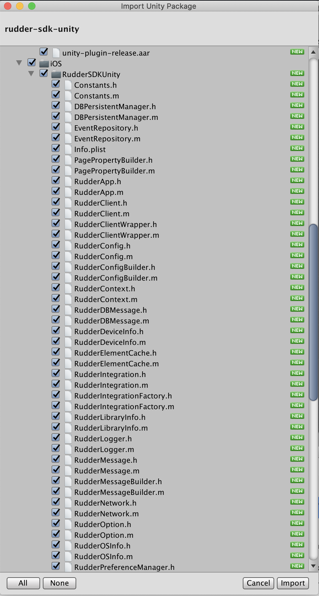

# Unity

## What is the RudderStack Unity SDK?

The RudderStack Unity SDK, simply put, is a wrapper on top of our [Android SDK](https://docs.rudderstack.com/rudderstack-sdk-integration-guides/rudderstack-android-sdk) or [iOS SDK](https://docs.rudderstack.com/rudderstack-sdk-integration-guides/rudderstack-ios-sdk) used for tracking event data in games. After integrating this SDK to your game, you will be able to track and send the game event data to any analytics destination of your choices such as Google Analytics, Amplitude, and more.


You can check the [Unity SDK codebase on GitHub](https://github.com/rudderlabs/rudder-sdk-unity) to get a more hands-on understanding of how it works.


## Setup requirements

To properly configure the Unity SDK, you will need the following:

* You will need a [RudderStack account](https://app.rudderlabs.com/login). Your source `writeKey` should appear on the dashboard once you have signed up.
* Your Data Plane URL. Simply put, the Data Plane URL is used to connect to the RudderStack backend for processing and routing your events. 


To get the **Data Plane URL**: _\*\*_

* If you're using the **open-source** version of RudderStack, you are required to set up your own data plane by [installing and setting up RudderStack](https://docs.rudderstack.com/installing-and-setting-up-rudderstack) in your preferred dev environment.
* If you're using the **enterprise** version of RudderStack, please contact us for the data plane URL with the email ID used to sign up for RudderStack.


* You will also need the [Unity development kit](https://store.unity.com/download).

## Adding Unity SDK to your project

* Download `rudder-sdk-unity.unitypackage` from our [Github Repository](https://github.com/rudderlabs/rudder-sdk-unity/raw/master/SDK/rudder-sdk-unity.unitypackage).
* Import the downloaded package to your project. From the **Assets** menu, go to **Import Package** - **Custom Package...** as shown in the following screenshot:


* Select `rudder-sdk-unity.unitypackage` from the location where you have downloaded it and click on **Open**:



* Click on `Import` in the import popup as shown:



## Initializing RudderStack client

Add the `import` to all the files where you wish to use `RudderClient` .

```csharp
using RudderStack;
```

After that, add the following code in the `Awake` method of your main `GameObject` Script:

```csharp
// Critical for iOS Applications where multiple components are using SQLite
// This has no effect for Android, but can be added as a safety check
RudderClient.SerializeSqlite();

// Build your config
RudderConfigBuilder configBuilder = new RudderConfigBuilder()
    .WithDataPlaneUrl(DATA_PLANE_URL);

// get instance for RudderClient
RudderClient rudderClient = RudderClient.GetInstance(
    WRITE_KEY,
    configBuilder.Build()
);
```


If you are building an iOS project, `RudderClient.SerializeSqlite()` is important to handle races with SQLite.


## Track

You can record the users' activity in your game through the `track` method. Every action performed by the user is called an event.

An example of the `track` event is as shown:

```csharp
// create event properties
Dictionary<string, object> eventProperties = new Dictionary<string, object>();
eventProperties.Add("test_key_1", "test_value_1");
eventProperties.Add("test_key_2", "test_value_2");

// create user properties
Dictionary<string, object> userProperties = new Dictionary<string, object>();
userProperties.Add("test_u_key_1", "test_u_value_1");
userProperties.Add("test_u_key_2", "test_u_value_2");

// create message to track
RudderMessageBuilder builder = new RudderMessageBuilder();
builder.WithEventName("test_event_name");
builder.WithUserId("test_user_id");
builder.WithEventProperties(eventProperties);
builder.WithUserProperties(userProperties);

rudderClient.Track(builder.Build());
```

```csharp
// create message to track
RudderMessageBuilder builder = new RudderMessageBuilder();
builder.WithEventName("test_event_name");
builder.WithUserId("test_user_id");
builder.WithEventProperty("foo", "bar");
builder.WithUserProperty("foo1", "bar1");

rudderClient.Track(builder.Build());
```

## Identify

The SDK captures the `deviceId` and uses that as `anonymousId` for identifying the user. It helps to track the users across the application installation. To attach more information to the user, you can use the `identify` method. Once you set the `identify` information to the user, those will be passed to the successive `track` calls. To reset the user identification, you can use the `reset` method.

An example `identify` event is as shown:

```csharp
RudderMessage identifyMessage = new RudderMessageBuilder().Build();
RudderTraits traits = new RudderTraits().PutEmail("some@example.com");
rudderClient.Identify("some_user_id", traits, identifyMessage);
```

## Reset

The `reset` method clears all the persisted traits of the previously identified user.

```csharp
rudderClient.Reset();
```

## Upgrading the SDK

Remove all the files related to RudderStack SDK from the `Plugins` folder. Also remove the `RudderUnityPlugin` folder completely before importing the newer version of the SDK.

The following is the list of files in `Plugins` folder for RudderStack SDK:

* `Plugins/Android/rudder-sdk-unity-plugin-android-release.aar`
* `Plugins/iOS/RudderSDKUnity`

## Contact us

In case of any queries, you can always [reach out to us](mailto:%20contact@rudderstack.com), or feel free to open an issue [on our GitHub Issues page](https://github.com/rudderlabs/rudder-sdk-android/issues) in case of any discrepancy. You can also start a conversation on our [Slack](https://resources.rudderstack.com/join-rudderstack-slack) channel; we will be happy to talk to you!

