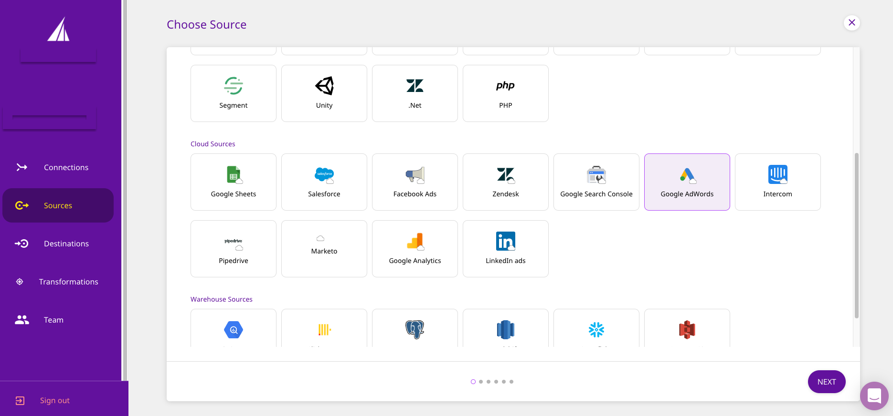
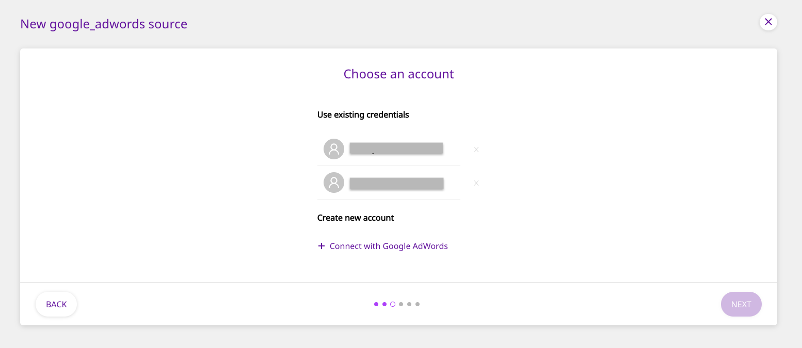
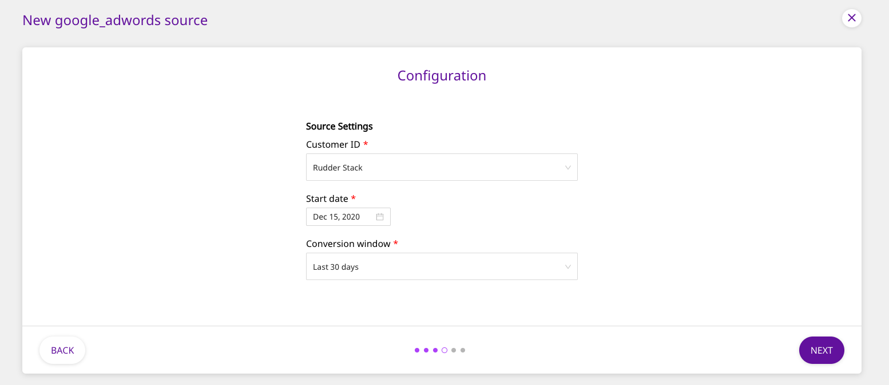
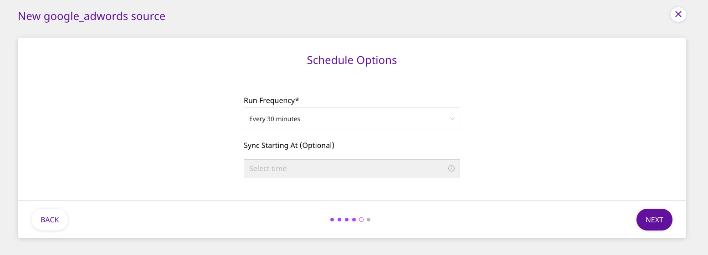
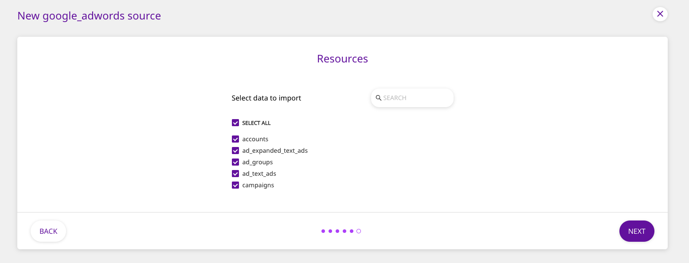
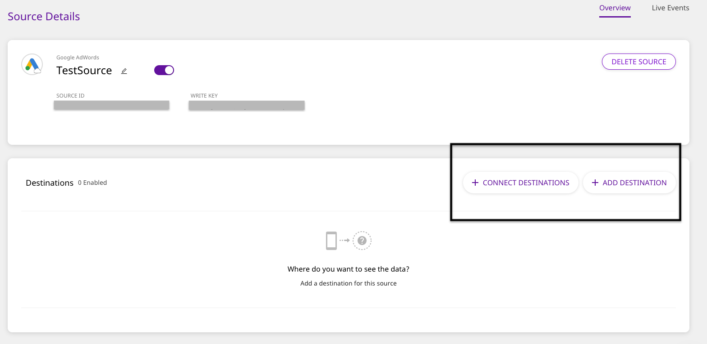

# Google AdWords

[Google AdWords](https://ads.google.com/intl/en_in/home/) is Google's premier online advertising platform. It allows advertisers to display their advertisements, as well as service offerings and product listings to prospective customers. With AdWords, you can place your ads within Google's search results, and also on your websites, mobile apps and videos. Google Adwords offers these advertisement services under a PPC \(pay per click\) model.

This document guides you in setting up Google AdWords as a source in RudderStack. Once configured, RudderStack automatically ingests your specified Google AdWords data, which can then be routed to your data warehouse or any other third-party destination supported by RudderStack.

## Getting Started

To add Google AdWords as a source in RudderStack, follow these steps:

* Log into your [RudderStack dashboard](https://app.rudderlabs.com/signup?type=freetrial).
* From the left panel, select **Sources**. Then, click on **Add Source**, as shown:

* Next, select **Google Analytics** from the list of **Cloud Sources**, and click on **Next**.

* Assign a name to your source, and click on **Next**.

### Setting Up the Connection

* Click on **Connect with Google AdWords** and give RudderStack the required access permissions. Then, click on **Next**.


If you have already connected RudderStack to your Google AdWords account, your credentials should appear automatically under **Use existing credentials**.


### Configuring the Source Settings

* After successfully connecting RudderStack to your Google AdWords account, the customer IDs associated with this account will automatically appear in the dropdown menu of the **Customer ID**, where you can select one. You also need to select a **Start Date** for your pipeline, which specifies the earliest date that RudderStack will start importing your AdWords data from. 


Please note that this **Start date** is valid only for the first \(historical\) sync.


### Setting the Data Update Schedule

* Next, you will be required to set the **Run Frequency** to schedule the data import from your Google AdWords account to RudderStack. You can also specify the time when you want this synchronization to start, by choosing the time under the **Sync Starting At** option.

### Specifying the Data to Sync

* Next, you need to specify the data you want RudderStack to import. By default, all the data resources are selected.

That's it! Google AdWords is now successfully configured as a source on your RudderStack dashboard. 

RudderStack will start importing data from Google AdWords as per the specified frequency. You can further connect this source to your data warehouse or other third-party destinations by clicking on **Connect Destinations** or **Add Destinations**, as shown:

## What Google AdWords data does RudderStack Import?

| **Property** | **Table Name** | **Description** |
| :--- | :--- | :--- |
| **Ad Groups** | **`ad_groups`** | This table contains information about the bounced people for your Ad Groups. The columns in this table include: `Name`, `CampaignName`, `labels`, `BaseCampaignId` with **`Id`** being the primary key. |
| **Campaigns** | **`campaigns`** | This table holds information information about your campaigns for your Google AdWords account. The columns in this table are: `name`, `startDate`, `frequencyCap` with **`id`** being the primary key. |
| **Report: Keywords Performance** | **`keywords_performance_report`** | This tables has information about your Google AdWords keywords' performance. The columns in this table are: `ActiveViewImpressions`, `AverageCost`, `AverageCpc`, `CampaignName`, `KeywordMatchType` |
| **Report: Click Performance** | **`click_performance_report`** | This table contains information about your Google AdWords' click performance. Columns include: `AccountDescriptiveName`, `AdGroupStatus`, `CampaignId`, `Clicks`, `ClickType` |
| **Report: Placement Performance** | **`placement_performance_report`** | This table contains the performance of your Google AdWords' placement. The columns in this table are: `AverageCpc`, `AdGroupStatus`, `Clicks`, `Device`, `Ctr`. |

## Contact Us

If you come across any issues while configuring Google AdWords as a source on the RudderStack dashboard, please feel free to [contact us](mailto:%20docs@rudderstack.com). You can also start a conversation on our [Slack](https://resources.rudderstack.com/join-rudderstack-slack) channel; we will be happy to talk to you!

