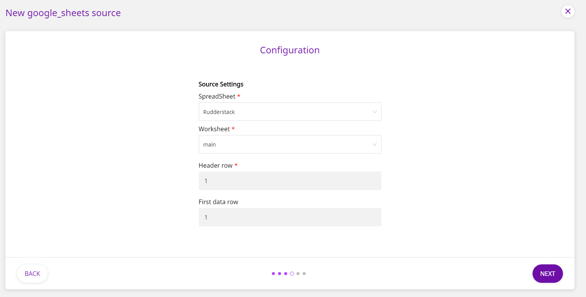

# Google Sheets

[Google Sheets](https://www.google.com/sheets/about/) is a popular spreadsheet program that is bundled as a part of the free, cloud-based office suite offered by Google. With Google Sheets you can seamlessly create spreadsheets that update and save automatically and are easy to access from your Google Drive. 

With the RudderStack-Google Sheets integration, you can send your spreadsheet data residing within Google Sheets to your preferred data warehouse or third-party destinations via RudderStack.

## Getting Started

Setting up the Google Sheet integration with RudderStack involves three major steps:

1. Specifying the connection credentials to integrate Google Sheets with RudderStack
2. Defining the Google Sheet and the workbook which will act as the source of data
3. Setting the data update schedule

To set up Google Sheets as a source on the RudderStack dashboard, follow these steps:

* Log into your [RudderStack dashboard](https://app.rudderlabs.com/signup?type=freetrial).
* From the left panel, select **Sources**. Then, click on **Add Source**, as shown:

* Next, select **Google Sheets**, and click on **Next**.

* Assign a name to your source, and click on **Next**.

### Specifying Connection Credentials

* Next, click on **Connect with Google Sheets**. Choose your Google account and give RudderStack the required permissions to access Google Sheets.


If you've already configured Google Sheets as a source before, you can choose the Google account under the **Use existing credentials** tab.


### Defining the Data Source

* Next, choose the Google Spreadsheet and the worksheet to be used as the data source. You will also need to specify the **Header row**. This is the row that contains the sheet’s headers and column names. 


By default, RudderStack uses the first row ****of the sheet as the header row.


* You will also need to specify the **First data row**. This is the row where the sheet’s data begins. Then, click on **Next** to proceed.


By default, RudderStack uses the row that follows the header as the first data row.


* RudderStack will automatically verify if the sheet is valid and contains any data. If the specified worksheet is empty, RudderStack will flag this automatically, as shown:

### Setting the Data Update Schedule

* As the final step, you will be required to set the **Run Frequency** to schedule the data import from your Google Sheet to RudderStack. You can also specify the time when you want this synchronization to start, by choosing the time under the **Sync Starting At** option.

That's it! Your Google Sheet is now successfully configured as a source. RudderStack will start ingesting data from the sheet as per the specified frequency. You can further connect this source to your data warehouse or other third-party destinations by clicking on **Connect Destinations** or **Add Destinations**, as shown: 

## Contact Us

If you come across any issues while configuring Google Sheets as a source on the RudderStack dashboard, please feel free to [contact us](mailto:%20contact@rudderstack.com). You can also start a conversation on our [Slack](https://resources.rudderstack.com/join-rudderstack-slack) channel; we will be happy to talk to you!

